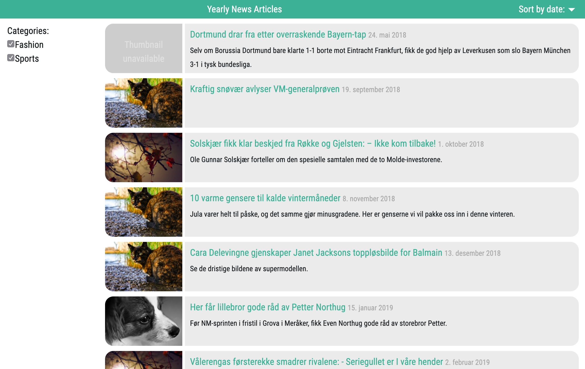
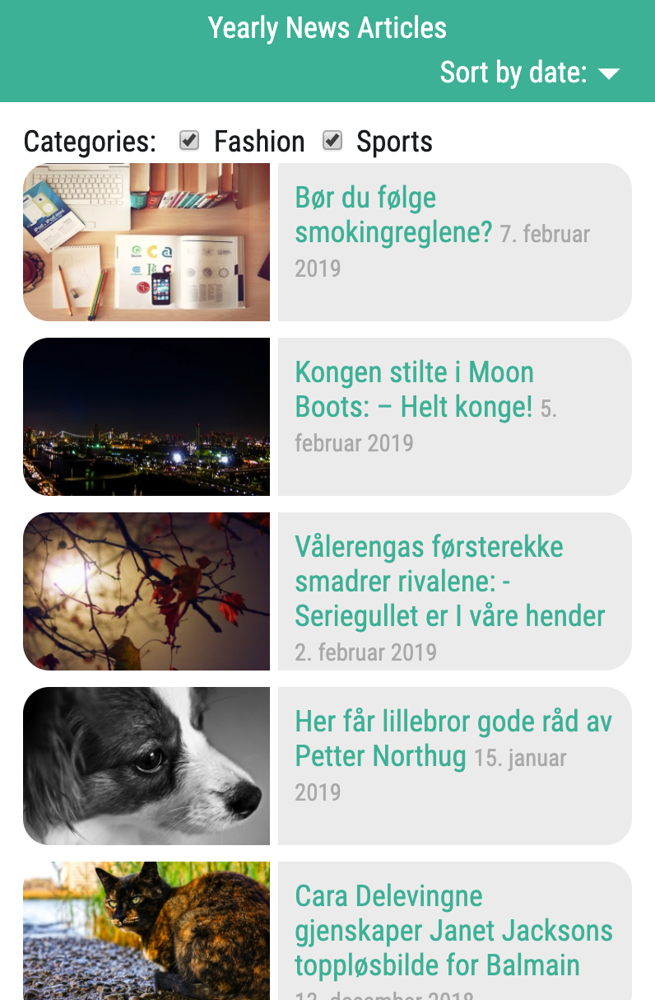

Articles list app. Technologies: React

To run dev application:
> `$ npm run start`

Application displays articles of chosen categories. Articles are fetched from API, where server status code 500 is handled. In case when API doesn't supply image, app displays defalt block. One or all categories can be selected.

Application could be improved by replacing standard state with Redux, but it's not implemented yet due to small size of app. Categories list can be simply extended, if API allows. Components could be tested with Jest.

